# Heart Failure Prediction by Azure ML studio
## overview of the project  
Explore the best model for binary classification with Azure ML Studio.
For model optimization, we will try two cases: a case where a deep learning model is optimized by hyperdrive, and a case where model selection and tuning are automated by AutoML. The evaluation metric is AUC. The best model will be deployed for use in web services.

### Summary

- AUtoML achieved better accuracy than tuning the hyperparameters of a single model.  
    | Algorithm      | AUC      |
    |---------------|-----------|
    | AutoML(VotingEnsemble) |0.96156 |   
    | HyperDrive(3layer DNN ) |0.82479  |
     
    AutoML is able to select a more superior model by trying multiple classifiers and narrowing down the most suitable model for the data while tuning the parameters.  
- Azure ML Studio enables seamless operation of workflow from model training to deployment. AutoML plays a central role in that.

- Further improvement of the model  
The number of data selected this time is just under 300, which is not enough to guarantee the generalization of the model. It is possible to build a robust model by collecting more data.  and it is effective to eliminate the highly correlated feature and reduce the variables.

## Dataset

### Overview
- An overview of the dataset used  
Cardiovascular disease (CVD) kills an estimated 17.9 million people each year. It accounts for 31% of all deaths worldwide.　Heart failure is often caused by CVD, and this dataset contains 12 features that can be used to predict heart failure mortality.  

    | No | Column                   | detail                                                                 |
    |----|--------------------------|------------------------------------------------------------------------|
    | 1  | age                      | age                                                                    |
    | 2  | anaemia                  | Decrease of red blood cells or hemoglobin (boolean                     |
    | 3  | diabetes                 | If the patient has diabetes (boolean)                                  |
    | 4  | creatinine_phosphokinase | Level of the CPK enzyme in the blood (mcg/L)                           |
    | 5  | ejection_fraction        | Percentage of blood leaving the heart at each contraction (percentage) |
    | 6  | high_blood_pressure      | If the patient has hypertension (boolean)                              |
    | 7  | platelets                | Platelets in the blood (kiloplatelets/mL)                              |
    | 8  | serum_creatinine         | Level of serum creatinine in the blood (mg/dL)                         |
    | 9  | serum_sodium             | Level of serum sodium in the blood (mEq/L)                             |
    | 10 | sex                      | Woman or man (binary)                                                  |
    | 11 | smoking                  | If the patient smokes or not (boolean)                                 |
    | 12 | time                     | Follow-up period (days)                                                |
    | 13 | Deth_Event               | If the patient deceased during the follow-up period (boolean)           |
    
    Dataset from Davide Chicco, Giuseppe Jurman: “Machine learning can predict survival of patients with heart failure from serum creatinine and ejection fraction alone. BMC Medical Informatics and Decision Making 20, 16 (2020)
- Data Profile
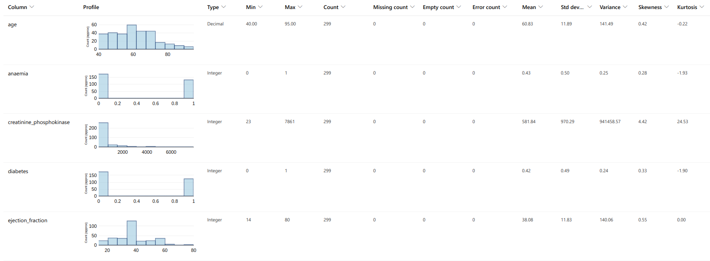
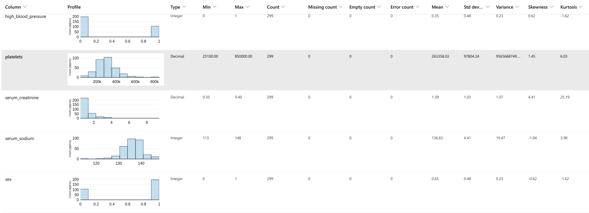
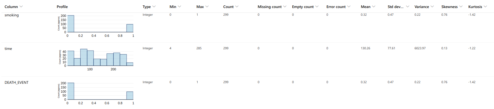
### Task
Based on this patient information, the patient's death (Deth_Event) is estimated. The explanatory variables use the remaining 12 futures.

### Access
- An overview of the method used to get the data into your Azure ML Studio workspace.  
Upload the CSV to the default datastore and make it accessible from my workspace.
Then store it in a dataset and convert it to pandas.
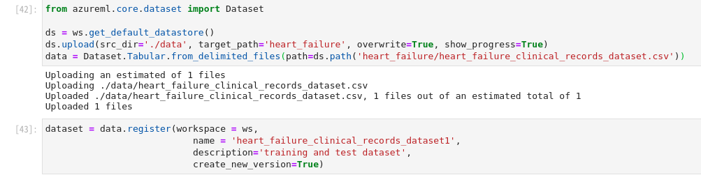
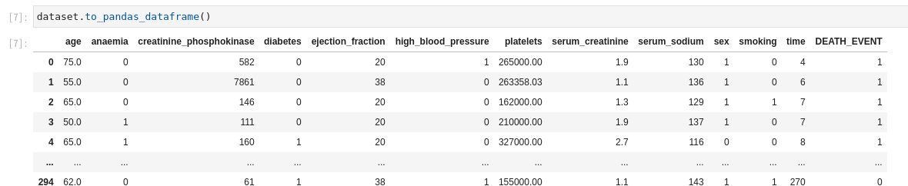

## Automated ML

* An overview of your AutoML experiment settings and configuration

    | parameter                 | detail                                                                                                            |
    |---------------------------|-------------------------------------------------------------------------------------------------------------------|
    | experiment_timeout_hours　 | Maximum time for the entire trial 20 minutes(0.3)                                                                 |
    | enable_early_stopping     | TRUE                                                                                                              |
    | iteration_timeout_minutes | Iteration timeout is 5 minutes.                                                                                   |
    | max_concurrent_iterations | Number of concurrent executions is 4 (number of compute clusters)）                                                |
    | max_cores_per_iteration   | Maximun  number of threads equal to the maximum number of cores on the compute target.(-1)                        |
    | primary_metric            | The metric that Automated Machine Learning will optimize for model selection is "AUC_weight"                      |
    | featurization             | – Categorical: Target encoding, one hot encoding, drop high cardinality categories, impute missing values.  |
    |                           | – Numeric: Impute missing values, cluster distance, weight of evidence.                                           |

    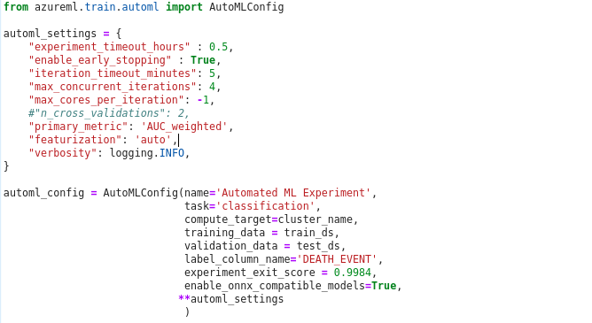

### Results  
* Best algorithm and AUC  
    | Algorithm      | AUC      |
    |---------------|-----------|
    | VotingEnsemble |0.96156 |   
 

* parameter 
    |parameter|values|
    |---------------------------|-----------|
    | min_samples_split | 0.10368421052631578  |
    | min_weight_fraction_leaf     | 0.0 |
    | n_estimators |10|
    | n_jobs |-1|
    | oob_score   | False|
    | random_state            | None  |
    | verbose             |0|
    | warm_start | False |

    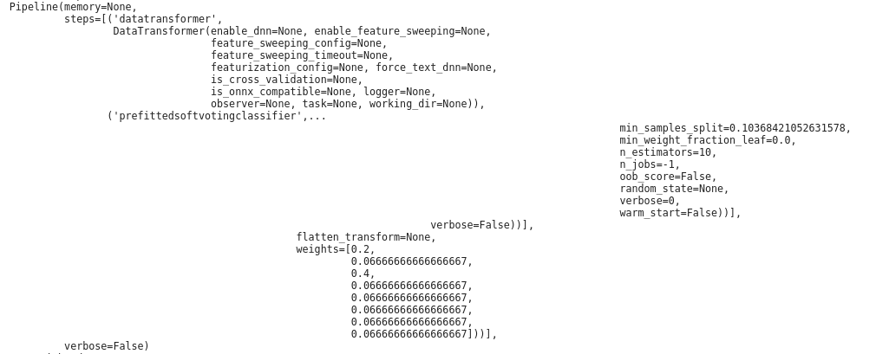

- best model  
 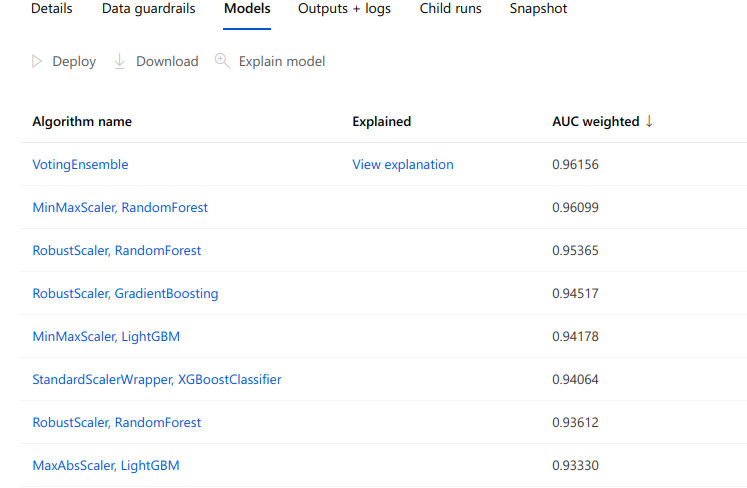
- `RunDetails` widget
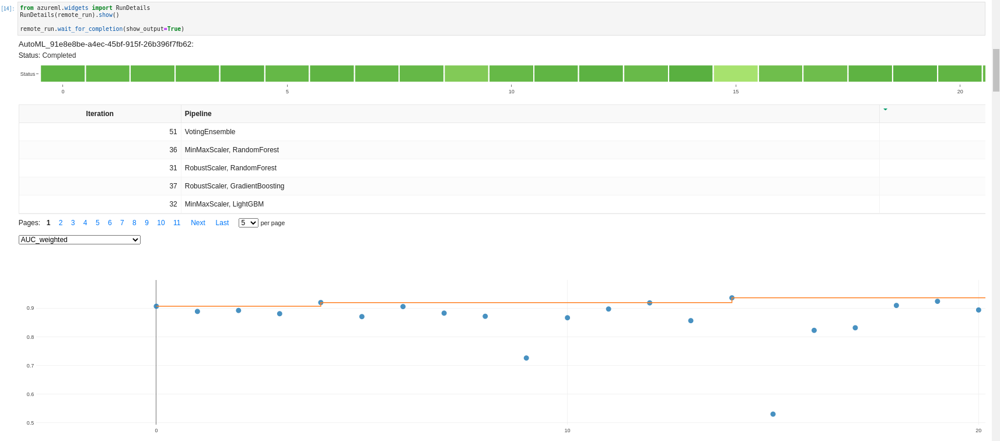

- data Guardrails  
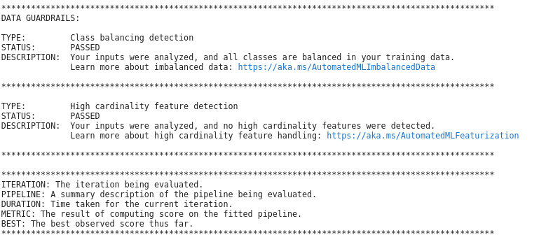
- histoty  
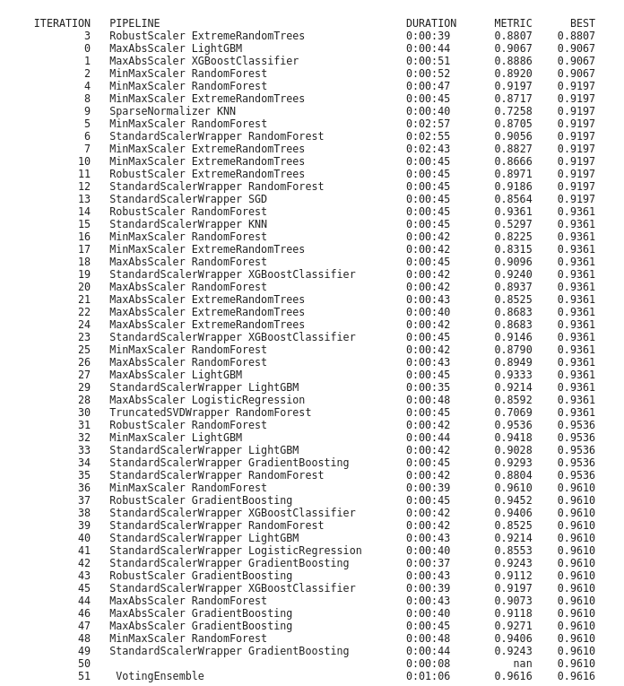

### furether improvement of model  
- The number of data selected this time is just under 300, which is not enough to guarantee the generalization of the model. It is possible to build a robust model by collecting more data.
- it is effective to eliminate the highly correlated feature and reduce the variables.
- Make Maximum amount of time in hours longer
- try cross validation
- try DNN on AutoML (enable_dnn chenge true)

## Hyperparameter Tuning

select 3-layer DNN
- Five parameters of the number of hidden layers (n_hidden_1,2,3) of each layer, learning rate (learning_rate), and batch size (batch_size) were optimized by high bar drive.
- Bathch normalization is placed on each layer to promote convergence and improve accuracy.
- Relu for activation function
- Prevent overfitting with Dropout

    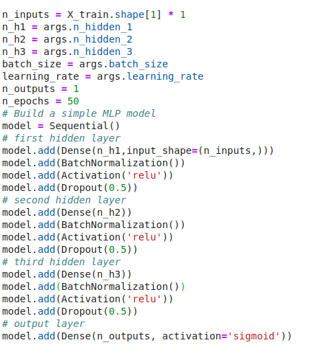

 - exsample

    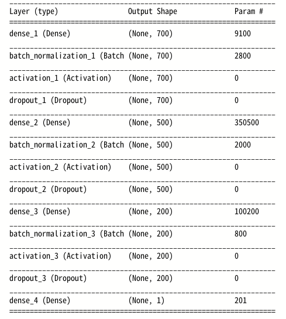

An overview of the types of parameters and their ranges used for the hyperparameter search  

- The parameter search applies random sampling, which is excellent for searching a good space with a few trials.

- Bandit Policy (evaluation_interval = 2, slack_factor = 0.1) is applied to the early termination policy. All runs with the best metric less than (1 / (1 + 0.1) or less than 91% of the best performing runs are finished

### Results

* Best  AUC  
    |  AUC              |
    |-------------------|
    |0.8247863247863249 |   
   

* best parameter  

    | parameter               |                        |
    |-------------------------|------------------------|
    | batch-size              | 25                     |
    | first-layer-neurons     | 700                    |
    | second-layer-neurons    | 700                    |
    | third-layer-neurons     | 500                    |
    | learning-rate'          | 0.009060857197988364   |

    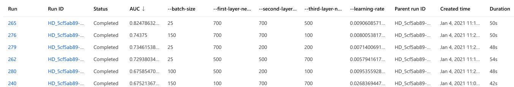
    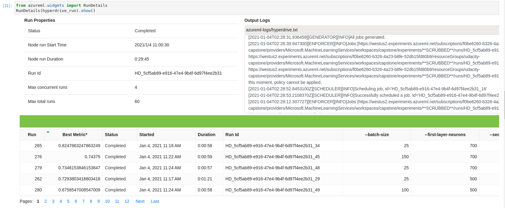
    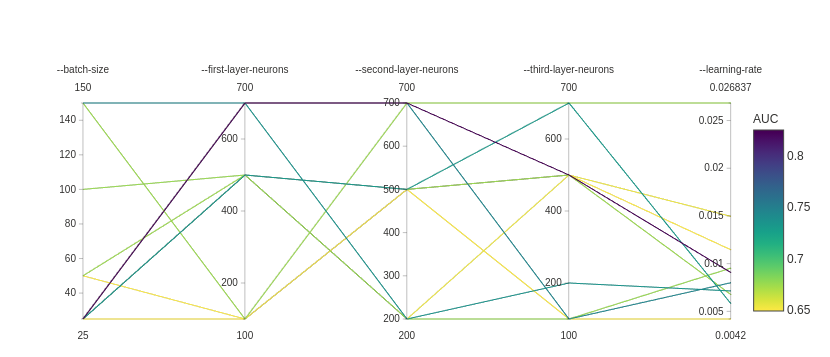

### furether improvement of model  
- The number of data selected this time is just under 300, which is not enough to guarantee the generalization of the model. It is possible to build a robust model by collecting more data.
- it is effective to eliminate the highly correlated feature and reduce the variables.
- try more layer Network and another activation function
- Try another algorithm that gives a good score in AutoML, such as boosting. 
-Make the sampling time longer and try BayesianParameterSampling 

    

## Model Deployment
deployed model and instructions 

The script scoring_file_v_1_0_0.py for the endpoint is exported to AutoML Output. The path to access the registered model is embedded in the script.
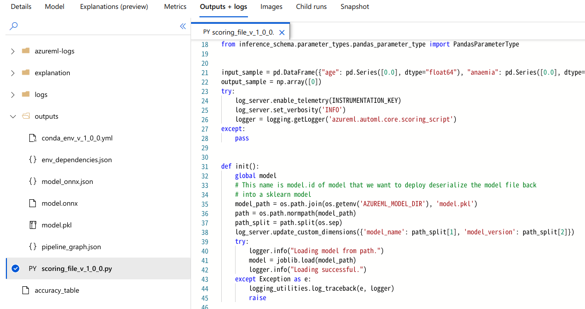
Copy scoring_file_v_1_0_0.py to the working directory for the container and deploy it to the container web service.
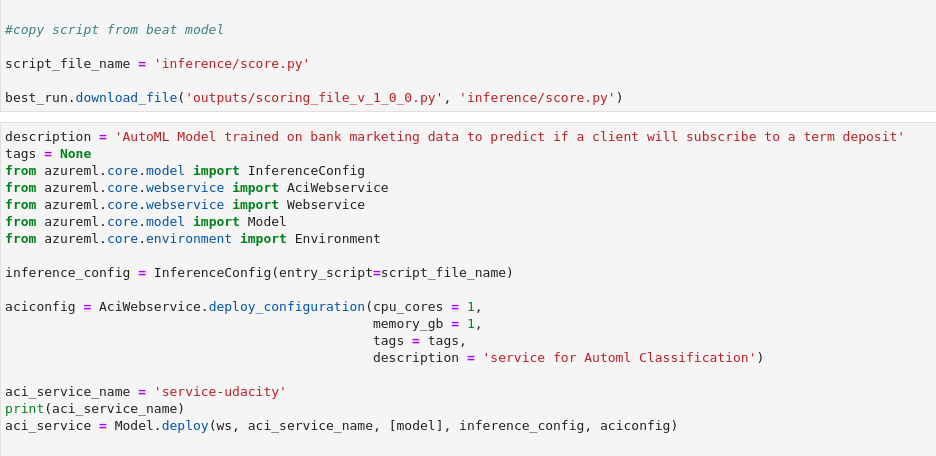
After a while, the web service will be launched and the URL will be published.
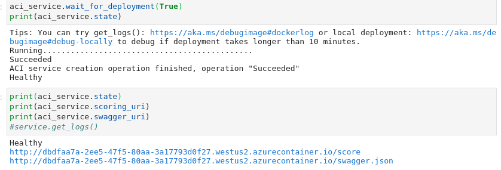
how to query the endpoint with a sample input  
Process the input file into Json format and POST it to a web service to get the result.
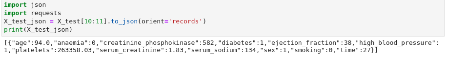
The following shows how 20 inputs are prepared and the estimation result of the deploy model is output.
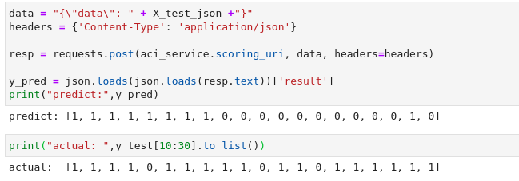

## Screen Recording
[capstone.MP4](https://github.com/fbamuse/udacity_azure_ML_capstone/blob/master/udacity%20azureML%20capstone.mp4)
